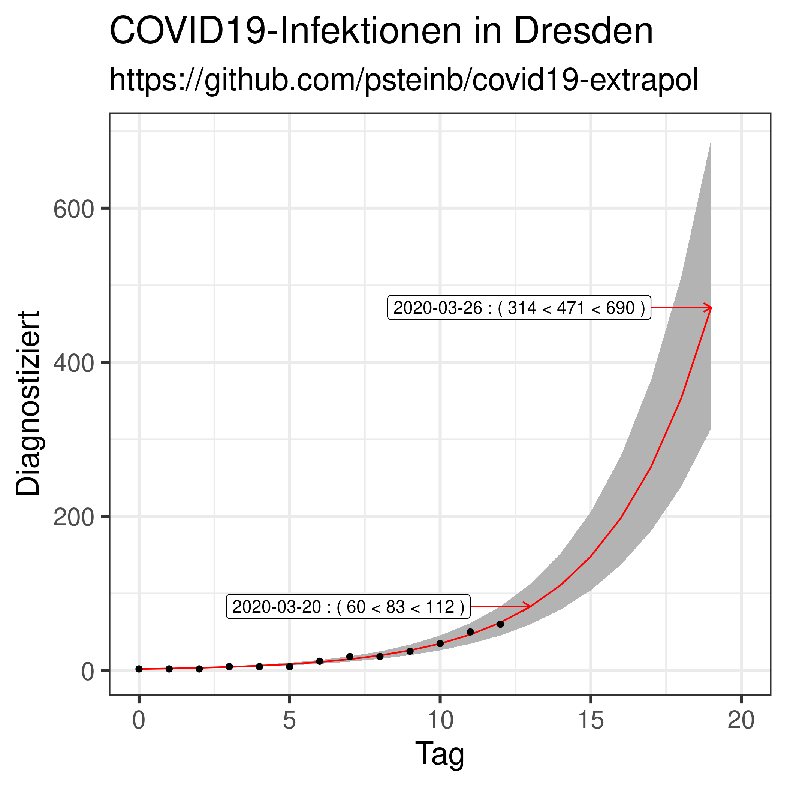

# Extrapolierte COVID19-Infektionen

## Dresden 



Datenquelle: [dresden.de](https://www.dresden.de/de/leben/gesundheit/hygiene/infektionsschutz/corona.php)

# Reproduziere das!

1. [R installieren](https://www.r-project.org)
2. `tidyverse` installieren

``` r
> install.packages(c("ggplot2","dplyr","readr","optparse"))
```

3. `exponential.R`-Script laufen lassen

``` 
$ Rscript exponential.R -i de_dresden.csv
```

