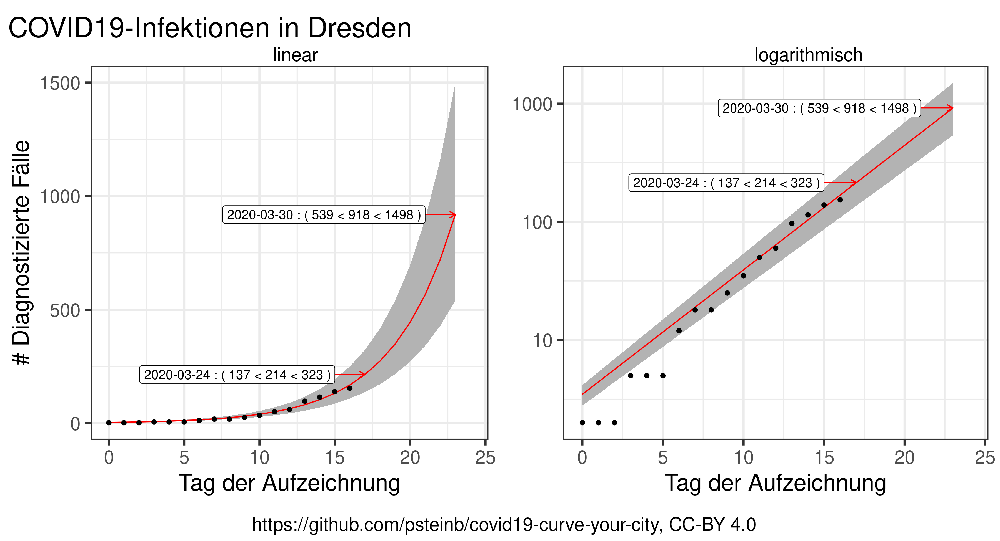
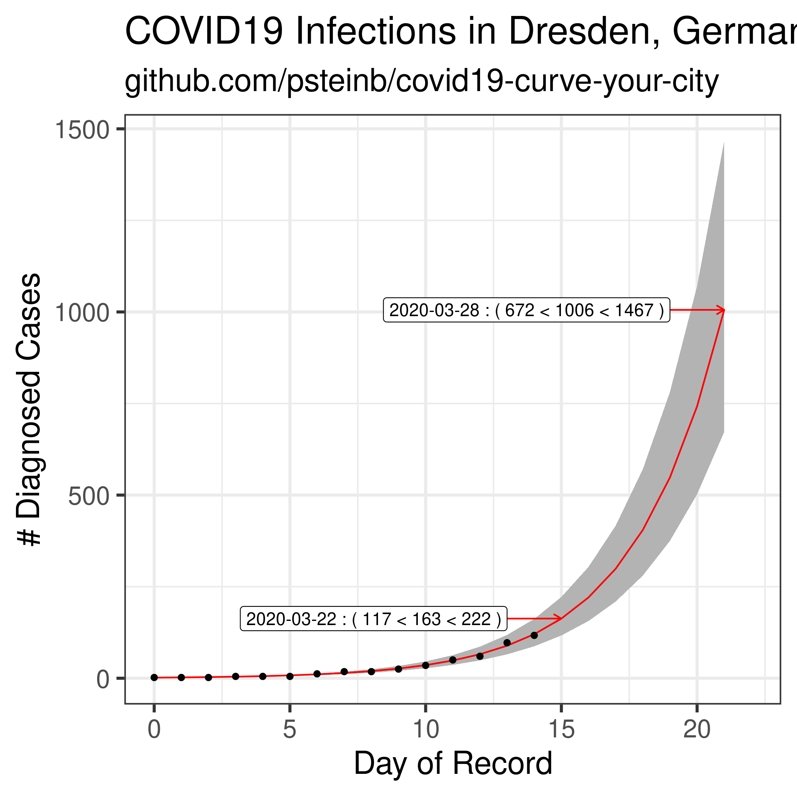

# Extrapolierte COVID19-Infektionen

## Dresden 

### Deutsch 



Datenquelle: [dresden.de](https://www.dresden.de/de/leben/gesundheit/hygiene/infektionsschutz/corona.php)

### English



data source: [dresden.de](https://www.dresden.de/de/leben/gesundheit/hygiene/infektionsschutz/corona.php)

# Reproduziere das!

## German

1. [R installieren](https://www.r-project.org)
2. Abhängigkeiten installieren

``` shell
$ R
> install.packages(c("ggplot2","dplyr","readr","optparse", "cowplot"))
```

3. `exponential.R`-Script laufen lassen

``` shell
$ Rscript exponential.R -i de_dresden.csv
```

4. Dies produziert zwei Dateien `de_plus5.png` und `en_plus5.png`.

## English

1. [install R](https://www.r-project.org)
2. install dependencies

``` shell
$ R
> install.packages(c("ggplot2","dplyr","readr","optparse", "cowplot"))
```

3. run `exponential.R` script

``` shell
$ Rscript exponential.R -i de_dresden.csv
```

4. this produces 2 files: `de_plus5.png` and `en_plus5.png` that contain the plots based on `de_dresden.csv`
