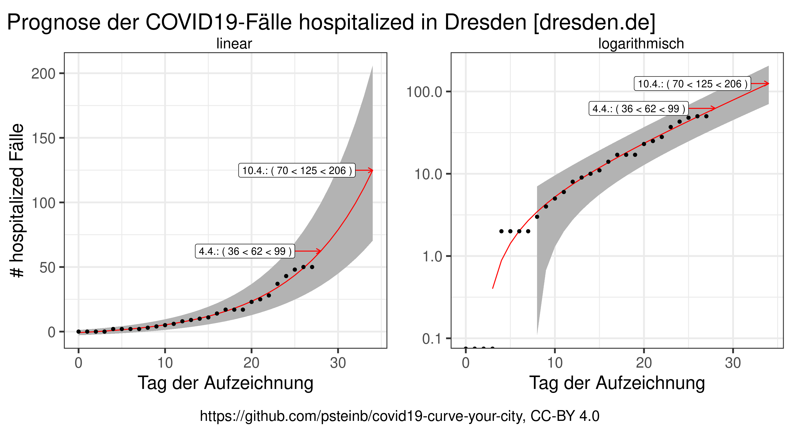
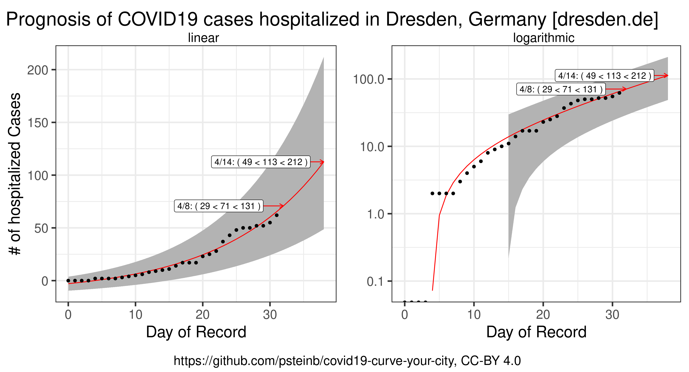
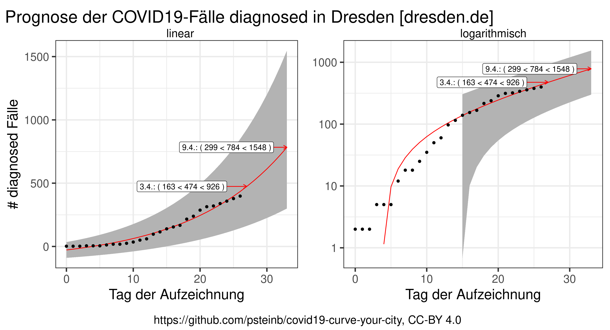
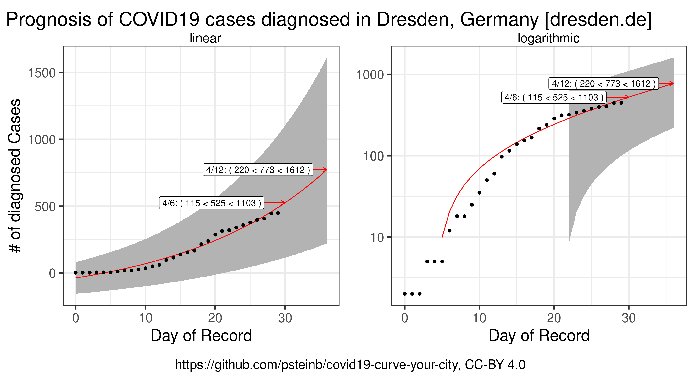
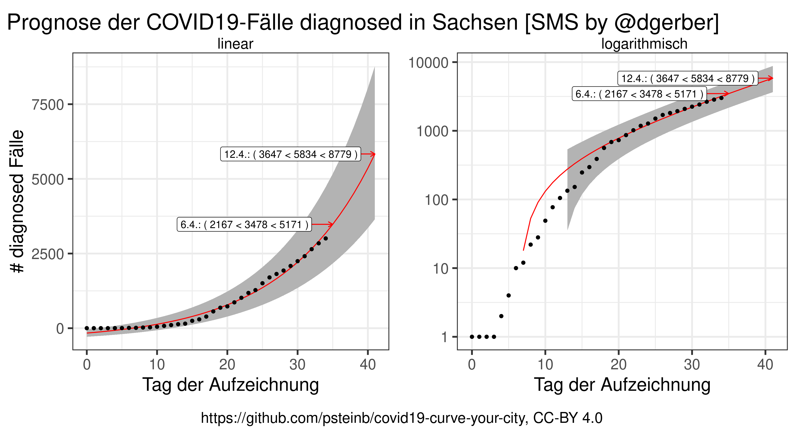
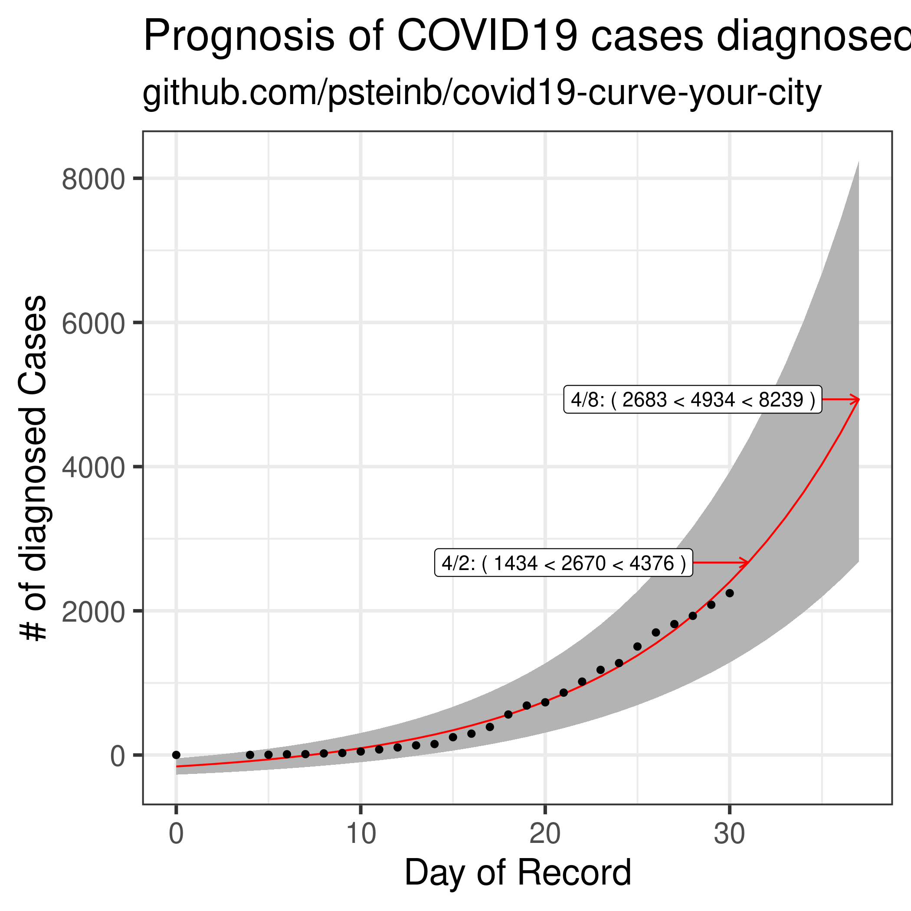
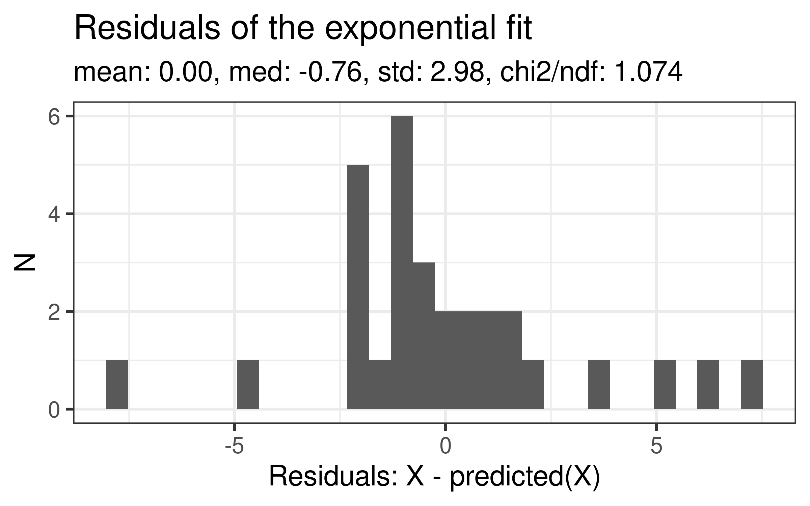
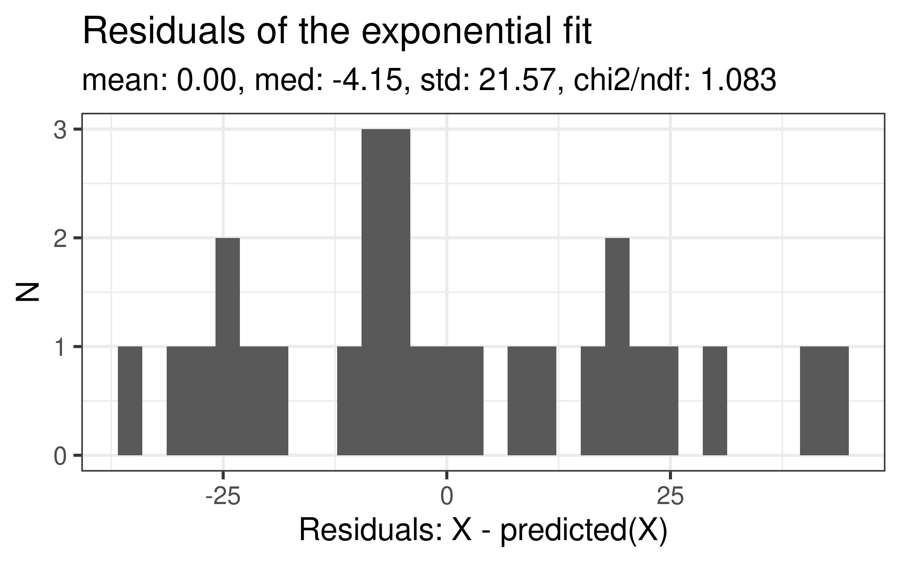

# Extrapolierte COVID19-Infektionen

## Warum machst du das? / Why are you doing this?

Ich bin kein Virologe noch ein Epidemiologe. Ich bin langjähriger [HPC](https://de.wikipedia.org/wiki/Supercomputer)-Nutzer, [Research Software Engineer](https://en.wikipedia.org/wiki/Research_software_engineering), Datenwissenschaftler und Machine-Learning-Praktiker.

Ich habe dieses Projekt ins Leben gerufen, um mit meinen mentalen Mitteln die Pandemie und den Virus zu verstehen und vielleicht ein Beitrag bei der Wissensvermittlung zu leisten.

---

I am no virologist and no epidemioligist. I am a seasoned [HPC](https://en.wikipedia.org/wiki/Supercomputer) user, [Research Software Engineer](https://en.wikipedia.org/wiki/Research_software_engineering), data scientist and machine learner practitioner. 

I created this project, to try to understand the SARS-COV-2 virus and the pandemic with my mental tools. I hope to potentially contribute to the communication of knowledge and results.

## COVID19 Im Krankenhaus / Hospitalized




Datenquelle/data source: [dresden.de](https://www.dresden.de/de/leben/gesundheit/hygiene/infektionsschutz/corona.php)


## COVID19-Diagnosen / Diagnoses

### Dresden




Datenquelle/data source: [dresden.de](https://www.dresden.de/de/leben/gesundheit/hygiene/infektionsschutz/corona.php)


### Sachsen




Datenquelle/data source: [SMS by @dgerber](https://danielgerber.eu/2020/03/22/corona-zahlen-in-sachsen/)


## Statistik

### Deutsch

Für die rote Linie im o.g. Plot benutze ich ein sehr einfaches Modell: das [exponentiellen Wachstum](https://de.wikipedia.org/wiki/Exponentielles_Wachstum) der COVID19-Pandemie. Ich fitte die Daten mit einem [Least-Squares-Verfahren](https://de.wikipedia.org/wiki/Methode_der_kleinsten_Quadrate) entsprechend der Formel für das Modell:

``` r
diagnosed ~ a*exp(b*day)
```

Wobei `a` und `b` freie Parameter sind.

### English

For the red line in the plot above, I use a simple model: the [exponential growth](https://en.wikipedia.org/wiki/Exponential_growth) of the COVID19 pandemia. I fit the data using a [Least Squares Algorithm](https://en.wikipedia.org/wiki/Least_squares) using the formula of the model:

``` r
diagnosed ~ a*exp(b*day)
```

Here `a` and `b` are free parameters.

# Reproduziere das!

## German

1. [R installieren](https://www.r-project.org)
2. Abhängigkeiten installieren

``` shell
$ R
> install.packages(c("ggplot2","dplyr","readr","optparse", "cowplot"))
```

3. `exponential.R`-Script laufen lassen

``` shell
$ Rscript exponential.R -i de_dresden.csv
```

4. Dies produziert zwei Dateien `de_plus7.png` und `en_plus7.png`.

## English

1. [install R](https://www.r-project.org)
2. install dependencies

``` shell
$ R
> install.packages(c("ggplot2","dplyr","readr","optparse", "cowplot"))
```

3. run `exponential.R` script

``` shell
$ Rscript exponential.R -i de_dresden.csv
```

4. this produces 2 files: `de_plus7.png` and `en_plus7.png` that contain the plots based on `de_dresden.csv`

## For Statistics Fans

### Residuals

My fit uses a simple exponential function. It is important to have a look at the residuals according to the same ordering as above.





The `nls` fit that I use, assumes that the data follows a Gaussian around the predicted values. The above plot looks like a very wide spread Gaussian. On top, there is a strong tendency towards positive values.

The plot above lists a parameter by the name `chi2/ndf`, if this is close to `1`, then the fit can be considered good. For more details, see the [wikipedia page on errors and residuals](https://en.wikipedia.org/wiki/Errors_and_residuals).

### Uncertainties

As I am using the standard uncertainties for all parameters from `nls` in R, these are 1 standard deviation uncertainties directly obtained from the square root of diagonal elements of the covariance matrix.
